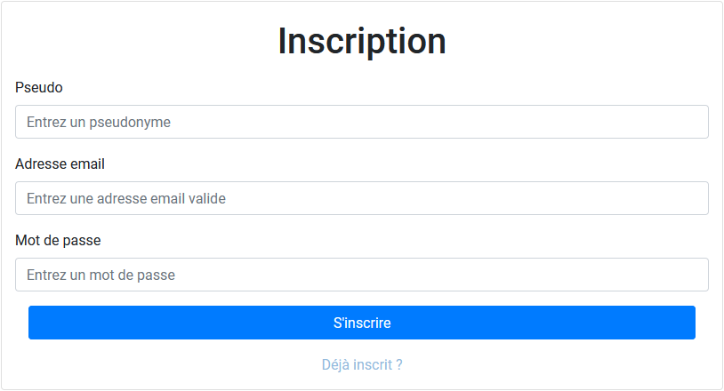
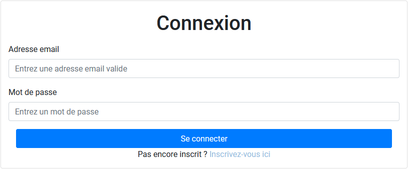
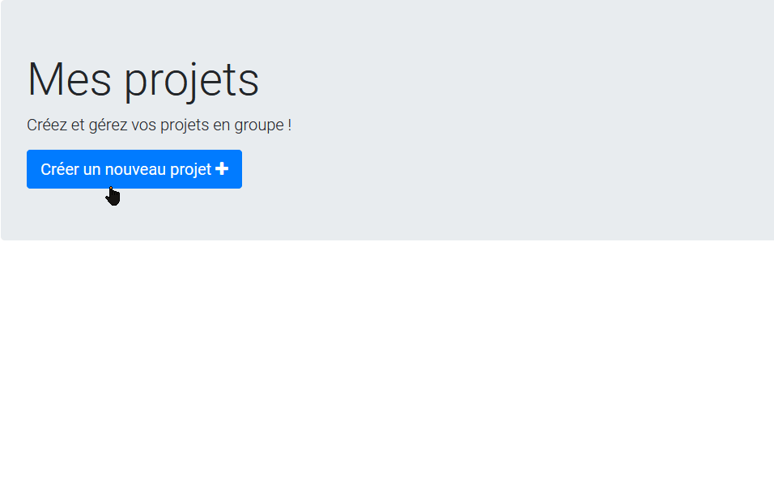
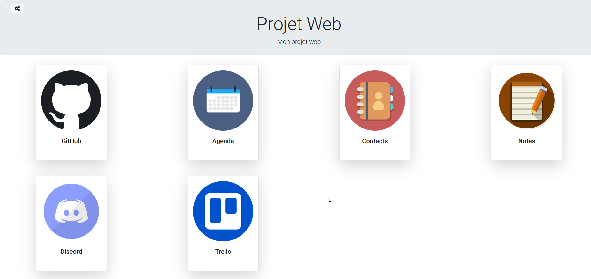

Projet de programmation Web - Master 2
=============================================================

Groupe : GOURGUE Antoine - MARTINEAU Flavien - PEYRICHOU Arthur

**Description du projet**

Site de gestion de projets destiné à des étudiants/développeurs, permettant de gérer et de récupérer toutes les informations relatives à leurs projet. Le site servant ainsi de "hub" en regroupant :

- Les informations du dépôt GitHub (API GitHub) : données des commits, etc...
- Outil de conversation (Discord)
- La gestion du projet avec Trello
- La gestion des contacts + dates importantes (ex: RDVs...) avec un agenda
- Ajout de notes diverses

Technologies utilisées
======================

- **Backend** : Node.js (Express)
- **Frontend** : Angular, Bootstrap
- **Base de données** : MongoDB (Mongoose)

Configuration
=============

**En mode développement :**

Pour démarrer le serveur frontend, aller dans le dossier /front et taper :

`npm install`
`ng serve --open`

Le serveur tourne sur le port 4200.

Pour démarrer la base de données MongoDB :

`docker-compose up -d mongodb`

Ensuite pour démarrer le serveur backend, dans le dossier /back :

`node app.js`

(port 3002)

**En mode production :**

`docker-compose up --build`

Le site est ensuite dispo en local sur le port 3002.

Déploiement Heroku
===================

Le site est également disponible sur Heroku via cette adresse :
`https://webproject-m2.herokuapp.com`

Utilisation
===========

