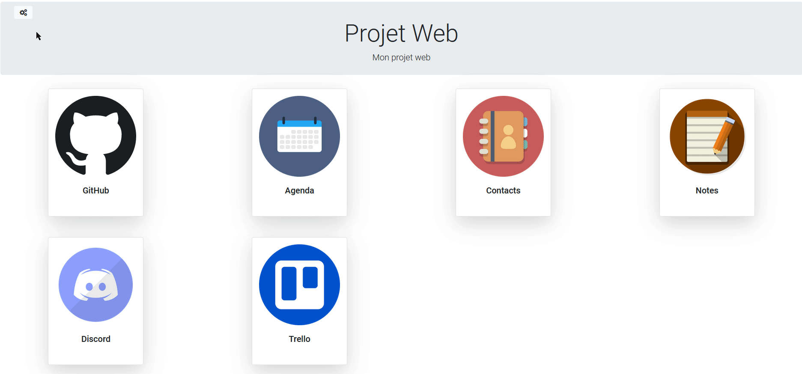

Projet de programmation Web - Master 2
=============================================================

Groupe : GOURGUE Antoine - MARTINEAU Flavien - PEYRICHOU Arthur

**Description du projet**

Site de gestion de projets destiné à des étudiants/développeurs, permettant de gérer et de récupérer toutes les informations relatives à leurs projet. Le site servant ainsi de "hub" en regroupant :

- Les informations du dépôt GitHub (API GitHub) : données des commits, etc...
- Outil de conversation (Discord)
- La gestion du projet avec Trello
- La gestion des contacts + dates importantes (ex: RDVs...) avec un agenda
- Ajout de notes diverses

Technologies utilisées
======================

- **Backend** : Node.js (Express)
- **Frontend** : Angular, Bootstrap
- **Base de données** : MongoDB (Mongoose)

Configuration
=============

**En mode développement :**

Pour démarrer le serveur frontend, aller dans le dossier /front et taper :

`npm install`
`ng serve --open`

Le serveur tourne sur le port 4200.

Pour démarrer la base de données MongoDB :

`docker-compose up -d mongodb`

Ensuite pour démarrer le serveur backend, dans le dossier /back :

`node app.js`

(port 3002)

**En mode production :**

`docker-compose up --build`

Le site est ensuite dispo en local sur le port 3002.

Déploiement Heroku
===================

Le site est également disponible sur Heroku via cette adresse :
`https://webproject-m2.herokuapp.com`

Utilisation
===========

**Authentification**
Sur /register, il est possible de créer un compte utilsateur.
Puis la connexion est possible sur l'écran /login.

Ensuite l'utilisateur est invité à créer un nouveau projet, en précisant un nom et une description.

**Accueil projet**
En cliquant sur l'icone en forme de maison, l'utilisateur est dirigé vers la page d'accueil du projet, où tout les services sont accessibles.

**Github**

Après ajout d'un lien de dépôt (et précisions des identifiants si le projet est privé), l'utilisateur peut acceder aux informations du dépôt GitHub.

**Agenda**

L'utilisateur peut ajouter des évènements sur le calendrier, en précisant le nom et la description de l'évènement.

**Contacts**

Pour ajouter un contact, il suffit d'ajouter un prénom, nom et une adresse email valide.

**Notes**

L'utilisateur peut ajouter des notes diverses en précisant un titre et une description.

**Discord**
Il est possible d'intégrer l'accès à un serveur discord (via un widget) en précisant les identifiants du serveur et du channel principal.

**Trello**
Après avoir renseigné l'URL d'un tableau Trello, ainsi que la clé API et son token utilisateur, l'utilisateur peut gérer le projet Trello : ajouter des cartes, listes, déplacement des cartes, etc...

**Invitation**
Sur l'accueil d'un projet, il est possible d'inviter de nouveaux membres. Le membre ajouté recevra une notification l'invitant à rejoindre ou non le projet.

